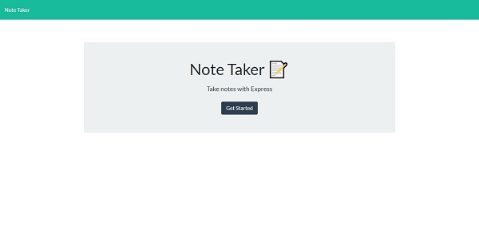
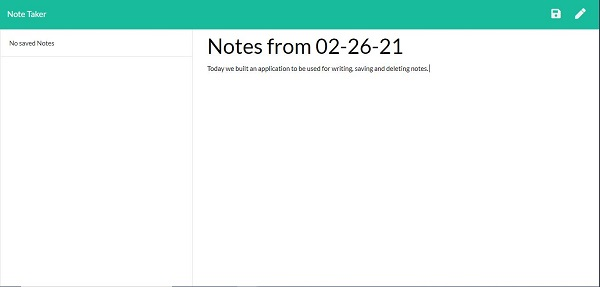
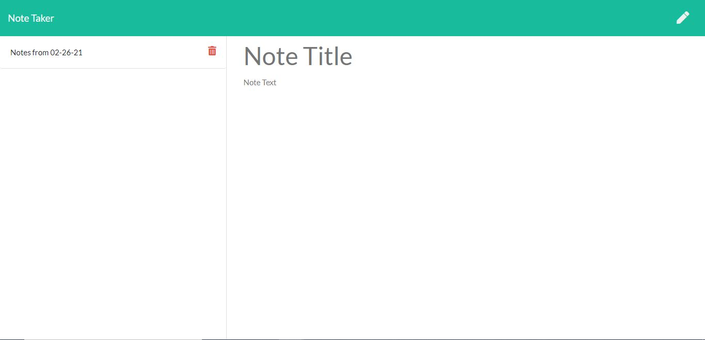

# Express-Note-Taker

## Description

## Demonstration

Deployed Link to Video Demonstration: 

Homepage Screenshot: 

Main Page where users can start to create, save and delete notes:  

How it looks when users input text and displays a Save button for the notes: 

How it looks once user saves notes and allows option to delete: 

## Technologies Used

## My Learnings

## Installation
