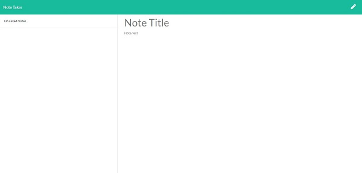

# Express-Note-Taker


## Description
</br>

## Table of Contents
* [Demonstration](#Demonstration)
* [Technologies Used](#Technologies-Used)
* [My Learnings](#My-Learnings)
* [Installation](#Installation)


## Demonstration
</br>

### Deployed Link to Video Demonstration: 
</br>

#### Homepage screenshot:
</br>


#### Main page where users can start to create, save and delete notes:
</br>



#### How it looks when users input text and displays a Save button for the notes:
</br>


#### How it looks once user saves notes and allows option to delete:
</br>


## Technologies Used
</br>

## My Learnings
</br>

## Installation

#### Start the server by running:
```
npm start
```
[Click Here to Return to Top Page](#Express-Note-Taker)